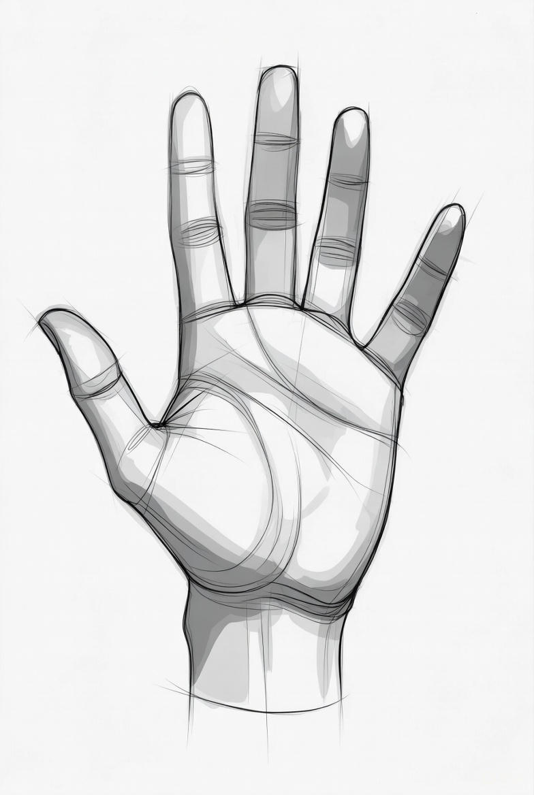
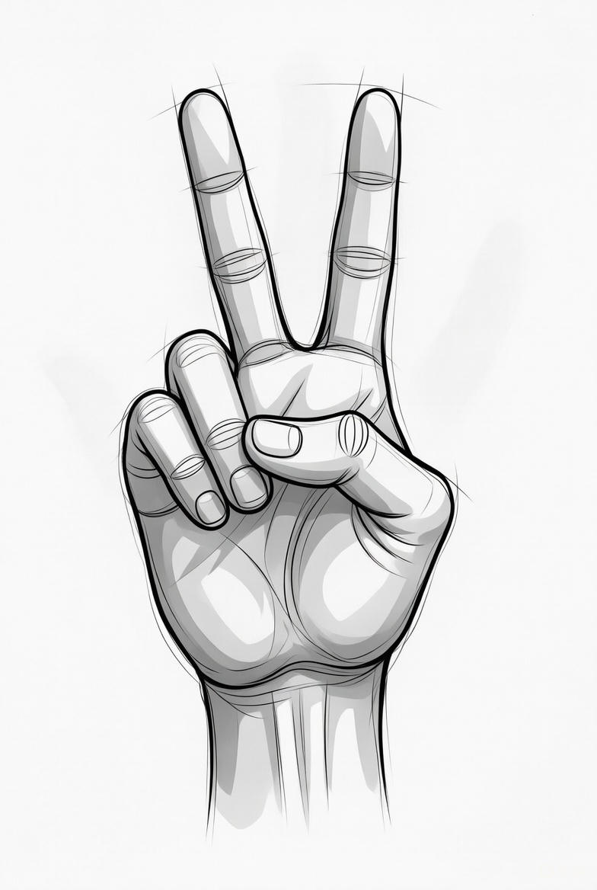

# Cobot Remote Control

Simultaneous control of two cobot arms via hand gestures.


## Getting Started

We recommend using an Ubuntu workstation for the steps below (other operating systems are not supported). However, if you are feeling "hacky" then no one should stop you from running the implementation on any OS as long as you are able to download and build the following packages manually:

```text
ROS2 Jazzy
ROS2 Control
MoveIt2
MoveIt2 Servo
MediaPipe
```

### 0. Clone this repo

```bash
mkdir ~/cobot_servo
cd ~/cobot_servo
git clone https://github.com/robgineer/cobot_servo .
```

### 1. Build the development environment
```bash
cd scripts
./docker_configuration.sh

```

In most cases this will be sufficient to build the docker container and execute it.

If you are missing some dependencies as `docker.io` or if you are running into an error similar to `0.276 groupadd: GID '1000' already exists`, then its best to have a closer look at the [readme](scripts/README.md) within the scripts directory.

### 2. Build the repo

```bash
source /opt/ros_venv/bin/activate
source /opt/ros/jazzy/setup.{sh/zsh}
colcon build --merge-install --symlink-install
source install/setup.{sh/zsh}
```
### 3. Launch the required nodes

Within the docker container:
```bash
export DISPLAY=:100
xpra start =:100
```

```
source install/setup.{sh/zsh}
ros2 launch teleoperation demo_ros_api.launch.py
```

On your local client:
```bash
xpra attach ssh://<user>@<host>:22/100
```

### 4. Launch remote control node

Open a new terminal within the docker container and execute

```bash
export DISPLAY=:200
xpra start =:200
source /opt/ros_venv/bin/activate
source /opt/ros/jazzy/setup.{sh/zsh}
source install/setup.{sh/zsh}
ros2 run teleoperation hand_control
```

Open a new terminal on your client and execute
```bash
xpra attach ssh://<user>@<host>:22/200
```


## Implementation Details

### Overview


```text
Classify hands from webcam (hand_tracker.py)
                ↓
    classify gestures of hands
                ↓
         generate command
                ↓
Asynchronous read of command from hand_tracker (servo_controller_node.py)
                ↓
    Convert index finger positions into velocities
                ↓
 Update or predict velocities (Kalman Filter)
                ↓   
                ↓    →  Send reset command via MoveItPy (exeption)
                ↓ 
   Send velocities to MoveIt2 Servo (normal operation)

```

The idea is quite simple: we track the hand movements, extract the velocities in (x-/y-direction) and forward these to MoveIt2 Servo. Due to (hardware) limitations, however, we had to implement a more complex solution. The application was running on a small (and old) notebook with 8GB of RAM and no GPU support. This implies that the webcam was running with max. 10 frames / second. Furthermore, MediaPipe's inference was far from "perfomant" on the selected hardware.
At the same time, MoveIt2 Servo expected continuous values; where 30ms has been defined as the preferred frequency for smooth arm movements. 

<br/>
In order to cope with these issues, we have used a Kalman Filter implementation that updated the velocity values only in case the hand tracker has updated hand movement values and predicted the velocity values otherwise. Refer `py_utils/filter_utils.py` for more details.

### Modules

`hand_control.py` : main module executing a separate thread for the hand tracking, updating a queue with control commands and passing these to the `servo_controller_node.py`.

`hand_tracker.py` : execution of MediaPipe's hand recognition, classification of hand commands and update of the queue for the  `servo_controller_node.py`. Runs as a separate thread out of `hand_control.py` (yes, it could be a ROS2 node but due to the hardware limitations, we tried to avoid any unnecessary ROS2 overhead).

`servo_controller_node.py` :
1. creates publishers for `twist` and `joint_jog` commands
2. subscribes to `status` topics of MoveIt2 Servo
3. unpacks hand tracker data
4. calls Kalman Filter update or predict functions
5. triggers command sending

`robot.py` : encapsulates logic for sending out commands to MoveIt2 Servo and to the move group (MoveItPy API). Uses methods from `planner_utils.py` for the latter.

`planner_utils.py` : a set of methods for the creation of a MoveItPy instance (used for cobot arm reset).

`filter_utils.py` : implementation of the Kalman Filter and velocity smoothing (yes, we filter twice: taking the "edge" of from noisy velocities with a simple exponential filter).

In order to visualize the raw x-/y-values from the hand tracker and the resulting (Kalman filtered) velocities, we have also implemented a small live plotter (`plot_utils.py`).


### Implemented hand gesture commands

We implemented the following commands for each cobot arm; where the left and right hand controls the left and right arm, respectively.

| Hand Gesture | Command | Details |  
|-----------------------|-----------------------|-----------------------|
|  | Follow hand | Send MoveIt2 Servo Twist commands via topic <br/> `delta_twist_cmds` |
|  | Move joint 5 up/down | Send MoveIt2 Servo Joint Jog commands for joint 5 via topic <br/> `delta_joint_cmds` |
|  | Move joint 6 up/down | Send MoveIt2 Servo Joint Jog commands for joint 6 via topic <br/> `delta_joint_cmds` |
|  | Reset cobot arm | Send joint positions using MoveItPy forward kinematics via the MoveIt2 Python API |

(Images generated by Grok from xAI)


### Safety related exception handling

In case a robot arm is close to a singularity, exceeding its joint limits or is close to a collision, we reset the robot to its original configuration using MoveItPy.
Refer

```
robot.py: execute_robot_fallback
py_utils/planner_utils.py: go_home

```

Note: `go_home` is applied for both, the safety reset and the command reset (described above).

Additionally, remote control is stopped in case more than two hands have been identified.

## The Robot Model Used

We have created a new model based on the [Cobot project](https://github.com/robgineer/cobot) that contains 6 DOFs and 2 arms. Each arm can be controlled separately. 

Check out the corresponding [readme](src/dual_cobot_model/README.md) for more details.

## Open Source Libraries Used

### [MediaPipe](https://github.com/google-ai-edge/mediapipe)

An inference API for various image recognition tasks. Works well with CPU only hardware and offers a very convenient Python API.

We use MediaPipe for the hand tracking and command classification.

### [ROS2 Jazzy](https://docs.ros.org/en/jazzy/index.html)

The middleware of the entire application. Enables scheduling and communication of software modules. Example: sending MoveIt2 Servo Twist commands via topic <br/> `delta_twist_cmds`.


### [ROS2 Control](https://control.ros.org/rolling/index.html)
An extension of ROS2 that contains controller implementations. We use the fake controllers for displaying the cobot arm movements in rviz.


### [MoveIt2](https://moveit.picknik.ai/main/index.html)

A robotics manipulation framework that contains various useful packages. We use MoveIt2 especially for the display of the robot arms (in rviz) and for forward kinematics (reset).

### [MoveIt2 Servo](https://moveit.picknik.ai/main/doc/examples/realtime_servo/realtime_servo_tutorial.html)

Enables real-time control of the cobot arms.

The communication between MoveIt2 Servo and the remaining parts are briefly shown in the following.

We send twist or joint jog commands to MoveI2 Servo; which integrates the commands and sends joint positions to the MoveIt2 Simple Controller Manager. The latter triggers ROS2 Control changing the robot's state =>  movement is visualized in rviz.

```text
twist / joint jog → MoveIt2 Servo →  MoveIt2 → ROS2 Control
```

As previously mentioned, we are using velocities for the control of the cobot arms. In detail, we are using `twist` and `joint_jog` commands.

### Twist Command Explained
Simplified, the twist command yields velocities for all joints given a velocity (and / or orientation) in 3 dimensions and is defined as

```math
\theta = J^{-1} \cdot q
```
where $\theta$ is the velocity vector for all joints,  $J^{-1}$ the inverse Jacobian and $q$ the 6 dimensional velocity vector.

Refer: Kevin M. Lynch, Frank C. Park, Modern Robotics, Cambridge University Press, June 2024, page 149.

### The Joint Jog Command Explained
Unlike the twist command, there is not much to calculate for the joint jog command. MoveIt2 Servo sends velocity on one or more joints in direction and orientation. In our implementation, we are only controlling the last two joints to move up or down.

