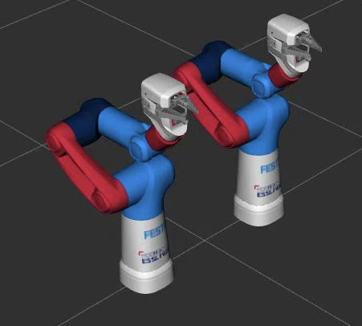

# Cobot Model

The model has been taken over from the [cobot project](https://github.com/robgineer/cobot/tree/main/src/cobot_model) and adjusted to contain only six DOFs (instead of seven).

## Copyright Notice
The original model was kindly provided by the company [**Festo SE & Co. KG**](https://www.festo.com/) and remains their intellectual property. Refer to their [GitHub profile](https://github.com/Festo-se) and their [website](https://www.festo.com/de/en/e/about-festo/blog/robotics-id_9229-1153/) for more information on their robotics related activities.
 
 
To access the original model refer commit [67d2b63d4f9a76d7f5c2ebf66c67b8af61d7ccd1](https://github.com/robgineer/artbot/commit/67d2b63d4f9a76d7f5c2ebf66c67b8af61d7ccd1).
 
 
License: the model (folder: *meshes* / *urdf*) is licensed under Apache-2.0. Kindly refer to the LICENSE.txt for more information.

## Model Overview

The model used represents a dual pneumatic arm. Each equipped with six joints, indexed as: 1 - 6, one finger gripper and two vacuum grippers.  

To learn more about the model and the physical characteristics, refer to the [cobot modelling notebook](https://github.com/robgineer/cobot/blob/main/src/cobot_model/doc/cobot_modelling.ipynb) of the cobot project.

